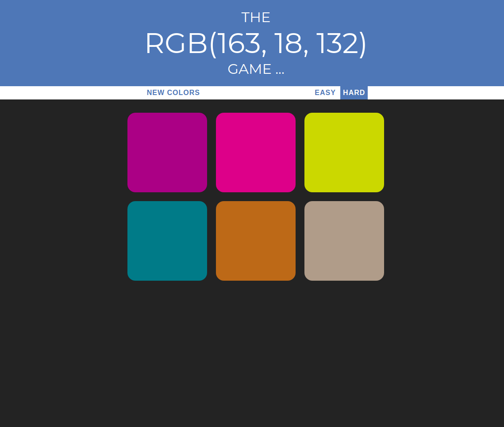

# RGB-Site

First web project from the course https://www.udemy.com/course/the-web-developer-bootcamp/ on Udemy.
An exercise in design. The user tries to guess which color is displayed in RGB format. They have option [easy] and [hard]. 

